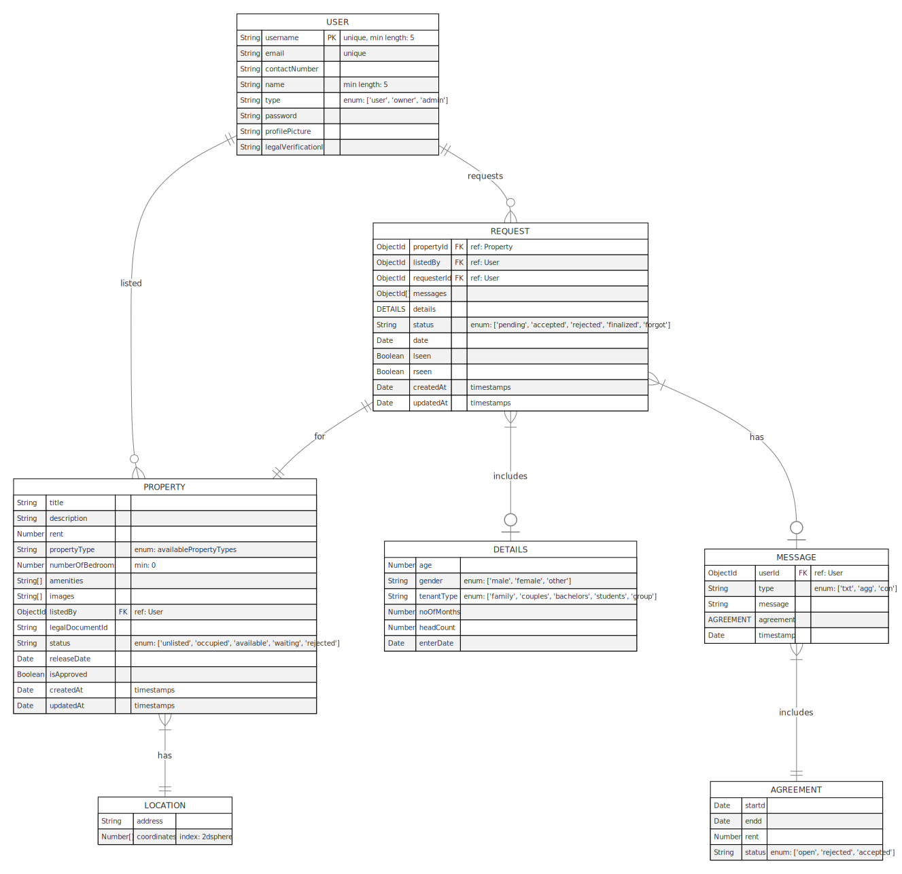

# RentIt  

MERN stack house rental app with realtime chat & request updates using socket.io.


## MongoDB Schema Relationship Diagram




## Installation

```sh
git clone https://github.com/nonkloq/rentit.git
cd rentit
```

rename `.env.example` to `.env` and fill in the variables in both frontend and backend folders.

### To Build And Run the app

@project root directory `~/rentit`
```sh
npm run build # will install all npm packages and build the project
npm run start
```

### To run server and client separately

to start the server
```sh
cd backend
npm install
npm run dev
```

to start the client
```sh
cd frontend
npm install
npm run start
```

The property listings are sampled from the [Houses Dataset](https://github.com/emanhamed/Houses-dataset) and property details filled using Gemini-1.5-Flash via the [Gemini API](https://ai.google.dev/). see [datafiller.ipynb](datafiller.ipynb) for code and data-filling process.
